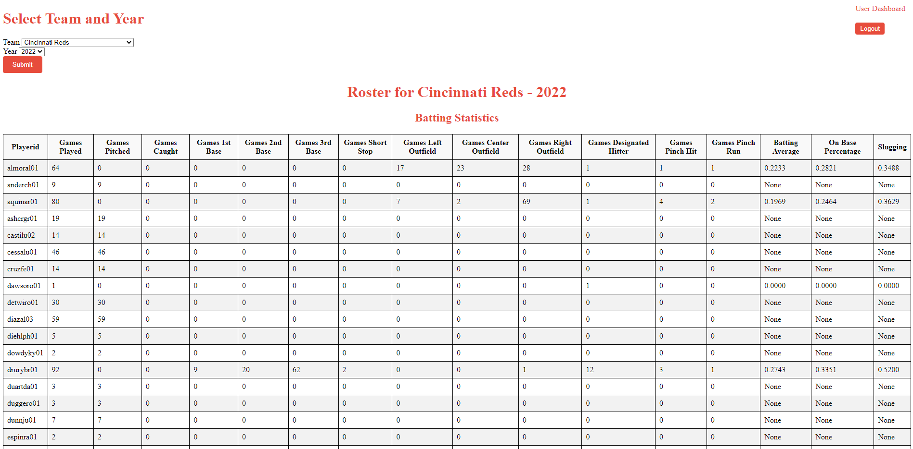

PLEASE READ THE WHOLE README. THANKS

# Database Project Pung
## Where to Start

    1. Begin by observing the different directories that I include
        a. database_input_scripts -> Holds scripts to insert data into your database. Includes the .sql file to create a database. 
        The paths to the lahman csvs will be relative so as long as you have the files in same main folder you will be good. 
        Ensure that you have already created a user: web , password : mypass like in the instructions within your own mariadb. 
        The instructions to set up the database will follow.

        b. lahman_csvs -> holds the csv files that will be read in by the scripts to the database. 
        This is the actual data that is in the database

        c. database_dump -> holds the dump sql for the newly created database and information within it. 

        d. flask_application -> holds the flask application itself. 
        You will call this directory in your python command prompt to run the dev server

        The directory overview:
            -lahman_csvs
            -database_dump
            -flask_application
            -database_input_scripts

    2. Set up your database
        -2nd section

    3. Run your installations (pip install...) and set up new virtual environment
            -This is handled in section 3 

    4. run your application 
        - This is in 4th section

    5. Extra credit
        -Explanation of how my project went above and beyond.

### Start by setting up your database
    There are two ways of setting up your database if I understand this correctly: 
    Option a is to use my scripts and insert the data I have provided that way or b. Use the database dump.
    If you use the dump (I am assuming you will) the database comes pre-loaded will multiple users (ben and admin)
    as well as some user logs from teams I have selected (like 30 for admin and some for ben);
    additionally the database is still there. 
    If you go with option A you will still have my base users (ben and admin) but no userlog data; 
    you will also have the database from the csvs. 
    Overall both are good options but if you want the database with pre-loaded logs I owuld use the dump.

    I would encourage you to use option b - the database dump.

    OPTION A:
        1. Ensure you have MariaDb instance installed
        
        2. Login with your root permisions and create a new user using the script in database_input_scripts 
        'create_Mariadb_setup' to ensure that you have created the web user and mypass password. 
        Note this may fail if you already have that user created.

            Note that you may have already created the web user so you may not need to do this step.

        3. login with your new user: 

            1. Open a new command line and find the directory for your mariadb installation
            2. Change directory to path of .\mariadb (cd <path>)
            3. Now type in 'bin\mysql -u web -p' and input your password. 
            This command calls the bin directory and mysql commandlet function calling your user 
            and letting you type in your password.
            
            example eventual full path in new command line: 'C:\Pung\Baylor\Databases\MariaDB\bin\mysql' -u web -p

        4. Create a new database
            The new database will be created in the next step. I create and use my database all in one because I thought it might be easier for you to just run 1 or 2 scripts if you need.

        5. Create tables and insert data into tables 

            a. Use my 'create_tables.sql' script found in the 'database_input_scripts' directory to create your tables.
            This script createss the database, uses the pung database, and then also creates all the tables. 
            You can run this .sql script and it will just create the instances of all the talbes you need. 
            You should be able to describe and show the tables... but there will be no data yet.

            Your database should have flipped to pung after running create_tables.sql. 
            If it was not working ensure you have mariadb running.

            try: (assume you are working in pung) :  "show tables" ....

            from there you should see 27 tables created.

            b. use the python script 'insert_data.py' to insert all your data.
            -please note that I have included the mariadb config file in two places: 
            one of which is the database_input_scripts to allow my scripts to connect to the database. 
            You may need to change this if you are using a different user than is 
            defined in the instrcutions and previous setup. The config file has the web, mypass user in it.

            *****ENSURE THAT YOU ARE WORKING IN THE DATABASE_INPUT_SCRIPTS DIRECTORY WHEN RUNNING THIS*******

            Please change cd to the database_input_scripts directory. 
            This is because I use relative paths in my insert_data.py script.

            your command to run part b should look like:

            c:///path to /database_input_scripts>python insert_data.py

            3. At this point please verify if you have :
                a. The pung database.
                b. 27 tables.
                c. data in all 27 tables from my csvs.
            
        6. Add in your user tables.

            a. You can run the script to create user tables and insert admin username/password

            This should add 2 tables.

            The file is in database_input_scripts. The file is called 'create_insert_users'.

            Please ensure that you are currently using the Pung table.

        OPTION B:

            Run your database dump file.
            Your database dump file is located in the database_dump directory
        
            You will need to create the table pung and then run a code similar to this below:

            mysql -u <username> -p <database> <path to dump>

            example: 
            -bin\mysql -u web -p pung < "C:\Pung\Baylor\Found Databases\python repo\project\database_dump\pung_dump.sql"

### Next is to set up your virtual environment
    -Start by setting up your new local host virtual environment: 
            Make sure that you have opened a new command prompt and navigated your working directory to the overall project directory
            
            create envs:
            (I used conda so this:)
            conda create --name demo python=3.8

            (On linux you can say )
            python -m venv <env name>

            You should now have env set up

            You can acvitate a conda env by saying 'conda activate <name>'
            or linux by saying 'source <path to venv>'
            You will need to activate env moving forward and use it.

    -Now we need to run all of our install such that the app cna run correctly.
        -I only included libraries you listed we were allowed to use

        run all: (similar to a requirements.txt)

        pip install flask
        pip install flask_sqlalchemy
        pip install flask_login
        pip install flask_wtf
        pip install pymysql
        pip install werkzeug (may already be satisfied via flask)

    Now you should have your activate environment and all libraries installed

### Next is to run your app
    In your new command window for the virtual environment change your working directory to the flask_app directory.
    Now run 'python app.py'. This will start the new server for you. You can navigate to the http webpage that it gives you.

    I am assuming you are using the database dump given so everything should now connect fine. 

    You are started off with 2 base users:

        1. admin
            password : mypass
        
        2. ben
            password : mypass

    You can log in with either but I would say go with admin because there is more functionality.
    the ben user is just regular user meaning it can just do the search team roster
     and nothing else but logout haha.

    If you are able to login then that means your database is connected and good to go. If not, 
    I would check the database set up.

    In particular, one thing that I am concerned about is:
        1. I used flask_sql alchemy but in the process I had to use a URI to connect to the database. 
        This required a specific port number. I looked it up and it seems like port 3306 is specifically 
        for all instances of mariadb in windows, mac, and linux so we should be fine.
        If you get a port errror I would look in app.py in line 14 where I included a variable to change 
        the specific port you need 

        'PORT = "3306"'...you may need to change this if the port is not working in linux

        2. I think you could check that the database has properly been instanced, it is running, 
        and you are logged in using the cs5302.py config file in the flask_app directory. 
        If you would like to change the user you may need to additional setup or something. 
        You can change this config there.

        For all of these setup errors I would in general work with the devops team or the database/sever 
        admins at my workplace to get this figured out. 
        I would hope I did everything alright enough on this project where it is just a matter of time to get 
        it pushed to produciton on new computer if that were needed in the future.

    Actual app:

    From here you should be directed to a user or admin dashboard that contains links for each action. 
    The admin can create users, look at logs, or query teams. The user can query teams.

    I left the app in debug mode so if any errors did occur you could find them. 
    In produciton I would turn it to production such that users can see the errors.

    Hopefully everything went smoothly!

### Extra credit things
    1. I took extra attention to use ORM's. This took me a while to implement but I felt like it was worth it in the end.
    I know other students probably wont do this part because the SQL queries are more in line with what
    we had done on previous assignments and seemed to take signficantly less set-up time.

    I felt like the ORM was harder, complex, and showed I could implement things that other web
     frameworks use like django (uses ORMs heavily) use in place of direct sql queries.
     ORMs are helpful because they prevent against injection attacks.

    2. I added a 'add user' functionality. This was not anywhere requested by the user requriements but I added it anyway. 
    Took a little while but handles some errors like the user already being in the database or the 
    password/username being way too long or having spaces. Overall cool functionality only accessible 
    to the admin via restrictions. Im sure other students wont have that so I think its a +.

    3. I took some time to format things nicely in the dashboards (in my opinion) by formatting the output tables, 
    adding links in accessible spots, and feel like my quality-of-life will be higher than others. 
    Maybe not a large plus but I do think the quality of life features like links in good spots, 
    dashboards for users/admins, and table borders for mine will be better than others. 
    
    I would include the additional CSS for color-coding and styling in this extra credit point.
    I think adding all of this css 
    is very important because for demos people honestly 
    underestimate the amount of work the backend is 
    and care a lot about how things look.
    I took a lot of time to do css on all of my pages.

    4. Added the CSRF protections via WTF forms. I think my security in inputs and within the abstraction 
    from the database is pretty good. I think that if you looked through my URLS and front end you
    be pleased with how I , to the best of my young ability, tried to avoid user injection attacks
    and protect CSRF or other things. Put protections for length and spaces in for
    username and password in login and creation of users.

Image 

